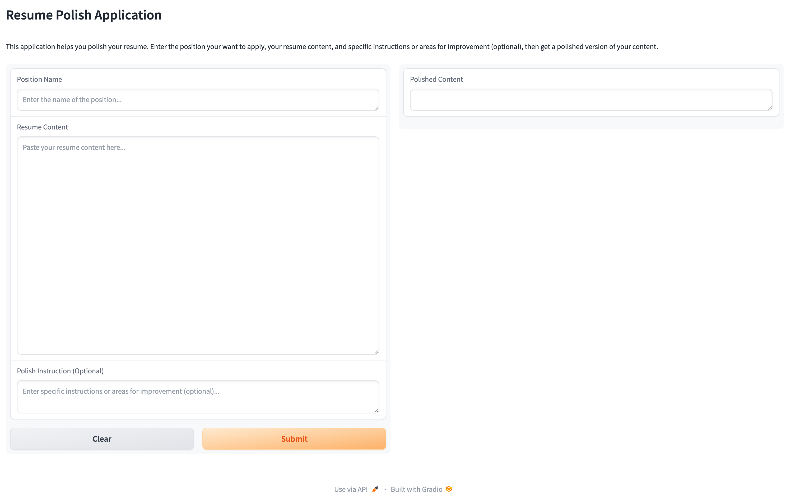
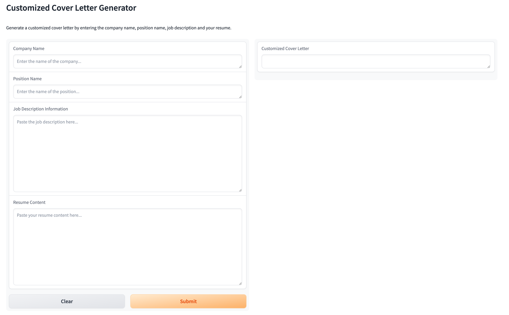

# FALCON AI Resume & Cover Letter Generator
 
 
 
## Transform Your Job Applications with AI

This project uses Foundation pretrained LLM model, powered by Falcon, to help users generate professional and personalized resumes and cover letters with minimal effort. Whether you’re applying for a technical, creative, or managerial role, this AI-powered tool streamlines the process and ensures your application materials stand out.

## Features

Industry-Specific Customization: Tailor your resume and cover letter to match specific industries and roles for maximum relevance.
Conversational Cover Letter Generator: Create personalized cover letters based on job descriptions and your personal experience.
Intuitive Interface: Easily input key information like work experience and skills, and let AI generate cohesive career documents.
Flexible Templates: Choose from various formats and designs suited to different industries or job positions.

## How It Works

Input Details: Users provide basic information like job title, company name, relevant experience, and key skills.
AI-Powered Generation: The system leverages the Falcon model to generate custom resumes and cover letters that fit the input provided.
Customization: Users can refine the generated output for further personalization.
Export: Professionally formatted resumes and cover letters, ready to be submitted to job applications.

## Technology Stack
Falcon (via Hugging Face): The core model for natural language generation, used to create tailored cover letters and resumes.
AutoTokenizer (Hugging Face): Processes input data and converts it into tokens that the Falcon model can understand.
PyTorch: Powers the machine learning framework used for model loading and text generation.
Gradio: Provides an interactive user interface to input data and view the AI-generated results.
Docker: Containerizes the application for easy deployment and environment consistency.
Model Details
Model: Falcon, a, open-source language model from TII, optimized for generating human-like text.
Text Generation: The Falcon model generates coherent cover letters using causal language modeling, ensuring that each word and phrase is contextually relevant to the user’s inputs.
Custom Parameters: The model uses parameters such as temperature (set to 0.7 for balanced creativity) and max_length to generate optimal cover letter outputs.
Results
Efficient: Reduces time spent on creating resumes and cover letters by automating the generation process.
High-Quality Outputs: Generated content is contextually relevant, personalized, and professional.
User-Friendly: The tool’s intuitive interface allows users of all technical levels to easily generate and refine documents.

##Future Enhancements

Job Portal Integration: Automatically tailor resumes and cover letters based on job descriptions from platforms like LinkedIn.
Multi-Language Support: Extend the tool’s capabilities to generate resumes and cover letters in multiple languages.
Reinforcement Learning: Use user feedback to continuously improve the quality of generated outputs.
Contributing
We welcome contributions! Feel free to open issues, submit pull requests, or suggest new features.
